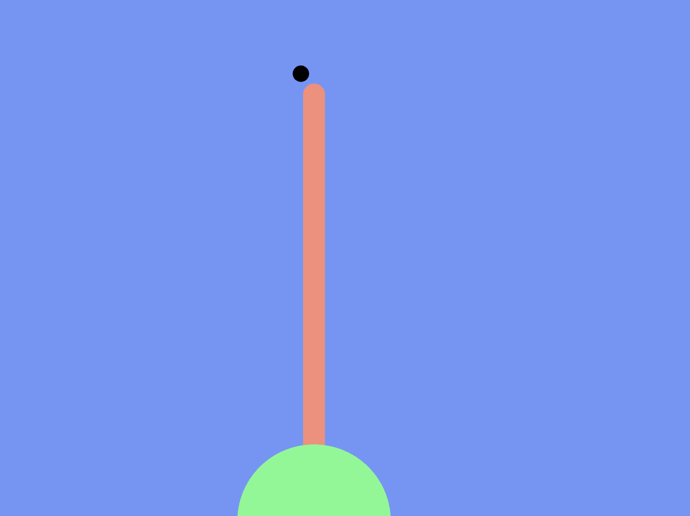

# Frogfrogfrog

Pippin Barr

[View this project online](https://pippinbarr.github.io/frogfrogfrog/)

## Description

FrogFrogFrog is a game/simulation about catching flies as a frog. You play as a frog at the bottom of the screen and can move left and right using the mouse. A fly flies past along the top of the screen and you can shoot your tongue out to try to catch it.

### Controls

- Mouse to move left and right
- Click to shoot tongue

## Screenshot(s)

## Attribution

This project uses [p5.js](https://p5js.org).

## License

This project is licensed under a Creative Commons Attribution ([CC BY 4.0](https://creativecommons.org/licenses/by/4.0/deed.en)) license with the exception of libraries and other components with their own licenses.
