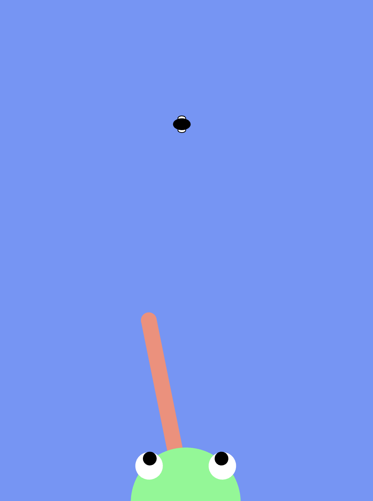

# Frogfrogfrog

Pippin Barr

[View this project online](https://pippinbarr.github.io/frogfrogfrog/)

## Description

FrogFrogFrog is a game/simulation about catching flies as a frog. You play as a frog at the bottom of the screen. A fly flies past along the top of the screen and you can shoot your tongue out to try to catch it by tapping/clicking a location. Best of luck.

### Controls

- Click/touch a target destination to shoot tongue

## Screenshot(s)

## Attribution

JavaScript libraries:
- [p5.js](https://p5js.org) and p5.sound.js

Sound assets are are all from freesound.org:
- [heavy_swallow.wav](https://freesound.org/people/Mikes-MultiMedia/sounds/368711/) by Mikes-MultiMedia
- [Slurping Sound (Variations: 1.Only with mouth 2.With liquid)](https://freesound.org/people/Idalize/sounds/408208/) by Idalize
- [FlyLoop.flac](https://freesound.org/people/acclivity/sounds/20797/) by acclivity
- [The sounds of the pond 04.wav](https://freesound.org/people/dibko/sounds/638417/) by dibko

## License

This project is licensed under a Creative Commons Attribution ([CC BY 4.0](https://creativecommons.org/licenses/by/4.0/deed.en)) license with the exception of libraries and other components with their own licenses.
